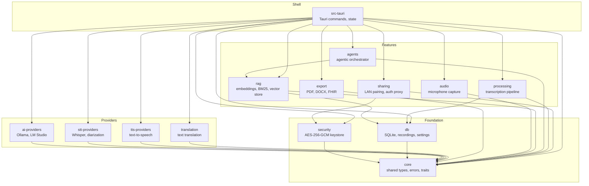
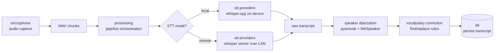
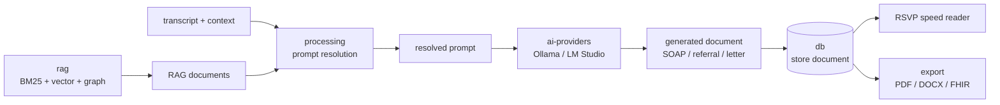
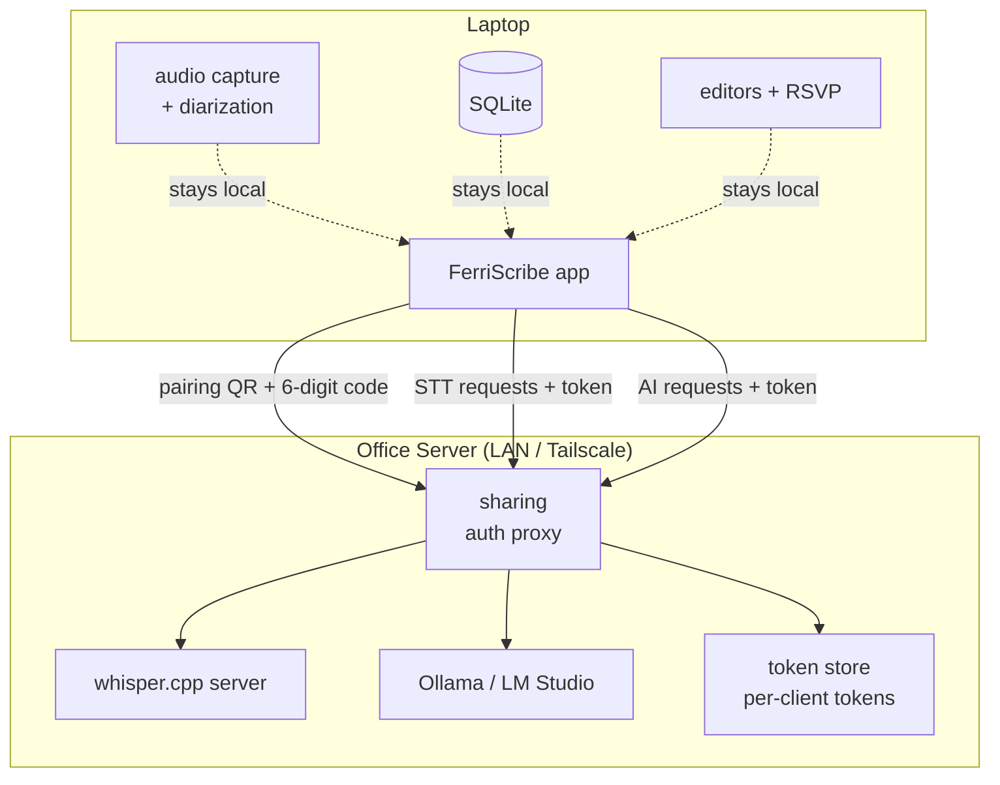

# FerriScribe Architecture

This document provides a visual overview of how FerriScribe's Rust workspace is organized:
which crates exist, how they depend on each other, and how data flows through the major
pipelines.

## Workspace Dependency Graph

The workspace is organized into four layers. Foundation crates provide shared types and
persistence. Provider crates interface with external services (AI, STT, TTS). Feature crates
implement domain logic (RAG, agents, pipeline orchestration, export, sharing, audio capture).
The Tauri app shell ties everything together.

## Transcription Pipeline

When a recording finishes, the transcription pipeline converts raw audio into a
diarized, vocabulary-corrected transcript. Audio capture feeds WAV chunks into
the processing pipeline, which dispatches to either local Whisper (on-device) or
remote Whisper (over LAN) for speech-to-text. Speaker diarization (pyannote +
WeSpeaker) always runs locally regardless of STT mode. Finally, custom vocabulary
rules are applied before the transcript is persisted to the database.

## Generation & Export Flow

After transcription, the clinician can generate SOAP notes, referrals, or letters.
The processing crate orchestrates generation by resolving the appropriate prompt
(base + context template + custom instructions), calling the AI provider (Ollama or
LM Studio), and optionally enriching with RAG-retrieved clinical documents. The
generated document is stored in the database and can be reviewed via RSVP speed
reader before export to PDF, DOCX, or FHIR R4.

## LAN Sharing Architecture

FerriScribe supports running AI inference on a powerful office server while
clinicians connect from laptops over LAN or Tailscale. The sharing crate handles
mDNS discovery, QR-code pairing, token-based authentication, and an auth proxy
that forwards Whisper and Ollama requests. Only STT and AI calls cross the wire;
audio capture, diarization, the SQLite database, and all editors stay local on
each laptop.

