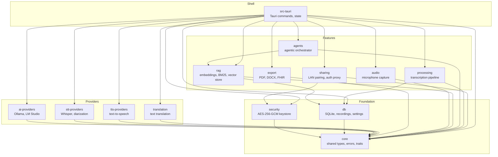
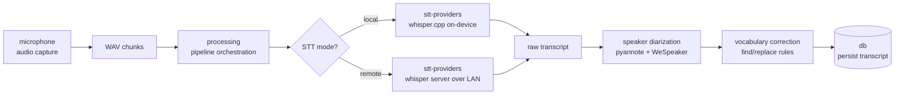
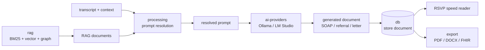
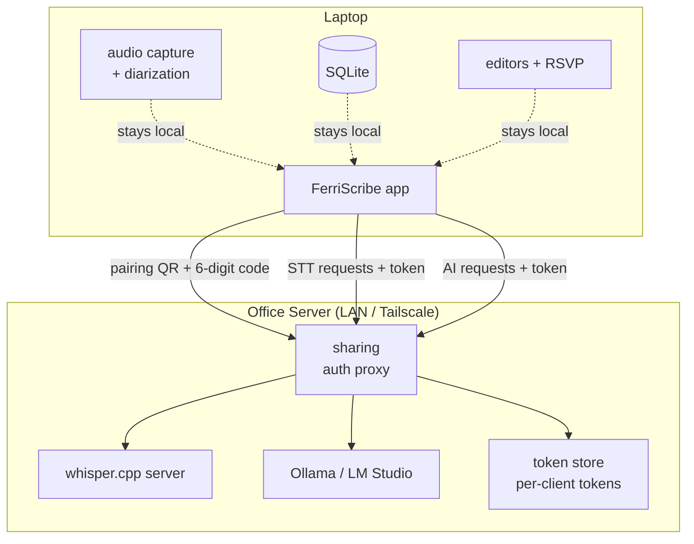

# FerriScribe Documentation Implementation Plan

> **For agentic workers:** REQUIRED SUB-SKILL: Use superpowers:subagent-driven-development (recommended) or superpowers:executing-plans to implement this plan task-by-task. Steps use checkbox (`- [ ]`) syntax for tracking.

**Goal:** Add architecture diagrams, crate READMEs, and inline API doc comments across the entire FerriScribe workspace so future-you can re-orient quickly.

**Architecture:** Layer-first documentation: (1) architecture diagrams give the big picture, (2) crate READMEs document each crate's purpose and boundaries, (3) inline `///` doc comments document the cross-crate public API. Foundation crates first, then providers, features, and finally the Tauri shell.

**Tech Stack:** Mermaid diagrams in markdown, Rust `///` doc comments, `cargo doc --workspace` for verification.

**No runtime code changes.** Every task is documentation only. "Tests pass" means `cargo check --workspace` and `cargo doc --workspace --no-deps` succeed with no new warnings.

---

## Dependency Graph (reference)

```
core (leaf — no workspace deps)
├── security       → core
├── db             → core
├── ai-providers   → core
├── stt-providers  → core
├── tts-providers  → core
├── translation    → core
├── export         → core
├── audio          → core
├── rag            → core, db
├── agents         → core, rag
├── processing     → core, db
├── sharing        → core, security
└── src-tauri      → all 13 crates
```

---

### Task 1: Architecture Diagrams

**Files:**
- Create: `docs/architecture.md`

- [ ] **Step 1: Create `docs/architecture.md` with 4 Mermaid diagrams**

Write the file with the following content. Each diagram gets a 2-3 sentence intro. Verify the dependency graph matches the `Cargo.toml` files before writing.

````markdown
# FerriScribe Architecture

This document provides a visual overview of how FerriScribe's Rust workspace is organized:
which crates exist, how they depend on each other, and how data flows through the major
pipelines.

## Workspace Dependency Graph

The workspace is organized into four layers. Foundation crates provide shared types and
persistence. Provider crates interface with external services (AI, STT, TTS). Feature crates
implement domain logic (RAG, agents, pipeline orchestration, export, sharing, audio capture).
The Tauri app shell ties everything together.



## Transcription Pipeline

When a recording finishes, the transcription pipeline converts raw audio into a
diarized, vocabulary-corrected transcript. Audio capture feeds WAV chunks into
the processing pipeline, which dispatches to either local Whisper (on-device) or
remote Whisper (over LAN) for speech-to-text. Speaker diarization (pyannote +
WeSpeaker) always runs locally regardless of STT mode. Finally, custom vocabulary
rules are applied before the transcript is persisted to the database.



## Generation & Export Flow

After transcription, the clinician can generate SOAP notes, referrals, or letters.
The processing crate orchestrates generation by resolving the appropriate prompt
(base + context template + custom instructions), calling the AI provider (Ollama or
LM Studio), and optionally enriching with RAG-retrieved clinical documents. The
generated document is stored in the database and can be reviewed via RSVP speed
reader before export to PDF, DOCX, or FHIR R4.



## LAN Sharing Architecture

FerriScribe supports running AI inference on a powerful office server while
clinicians connect from laptops over LAN or Tailscale. The sharing crate handles
mDNS discovery, QR-code pairing, token-based authentication, and an auth proxy
that forwards Whisper and Ollama requests. Only STT and AI calls cross the wire;
audio capture, diarization, the SQLite database, and all editors stay local on
each laptop.


````

- [ ] **Step 2: Verify the file renders correctly**

Run: `wc -l docs/architecture.md`
Expected: ~120-140 lines

- [ ] **Step 3: Commit**

```bash
git add docs/architecture.md
git commit -m "docs: add architecture diagrams (dependency graph, data flows, LAN sharing)"
```

---

### Task 2: `core` Crate README + Inline Docs

**Files:**
- Create: `crates/core/README.md`
- Modify: `crates/core/src/lib.rs` (add module-level `//!` doc comment)
- Modify: `crates/core/src/error.rs` (add `///` doc comments on public items)
- Modify: `crates/core/src/endpoint_policy.rs` (add `///` doc comments)
- Modify: `crates/core/src/preflight.rs` (add `///` doc comments)
- Modify: files in `crates/core/src/types/` and `crates/core/src/traits/` (add `///` doc comments on public items)

**Dependencies:** None (leaf crate)
**Dependents:** All other 13 crates

- [ ] **Step 1: Read all source files to understand the public API**

Read these files in order:
1. `crates/core/src/lib.rs` — module structure and re-exports
2. `crates/core/src/error.rs` — `AppError`, `AppResult`, error severity
3. `crates/core/src/endpoint_policy.rs` — endpoint policy types
4. `crates/core/src/preflight.rs` — preflight check types
5. `crates/core/src/http_error_body.rs` — HTTP error body handling
6. All files in `crates/core/src/types/` — shared domain types
7. All files in `crates/core/src/traits/` — shared traits (e.g., provider traits)

- [ ] **Step 2: Write `crates/core/README.md`**

Write a README (~150-200 lines) following this template. Fill in actual content based on what you read in Step 1:

```markdown
# medical-core

Shared types, traits, and error handling for the FerriScribe workspace.

## How It Fits

Core is the leaf crate — every other workspace crate depends on it, but it
depends on none of them. It defines the error types (`AppError`, `AppResult`),
shared domain types (recording metadata, provider configuration), and trait
interfaces that provider crates implement.

If you're adding a new crate to the workspace, `medical-core` is almost
certainly in your `[dependencies]`.

## Key Types

[List the 3-5 most important types with a sentence each. Examples:]
- `AppError` / `AppResult<T>` — The workspace-wide error type. Variants cover
  config, network, database, and provider errors.
- [Other key types based on what you read]

## How It Works

[Explain the error type design, the trait interfaces that providers implement,
and any important domain types. ~2-3 paragraphs.]

## Examples

[Show 1-2 real patterns of how other crates use core types. Look at
`crates/db/src/lib.rs` or `crates/ai-providers/src/lib.rs` for real imports
and usage patterns.]

## Edge Cases & Gotchas

[Document any non-obvious aspects: error variant selection guidance,
serialization requirements, trait contract expectations.]
```

- [ ] **Step 3: Add module-level doc comment to `lib.rs`**

Add a `//!` doc comment at the top of `crates/core/src/lib.rs` (before the `pub mod` declarations):

```rust
//! Shared types, traits, and error handling for the FerriScribe workspace.
//!
//! This crate is the foundation leaf — every workspace crate depends on it.
//! It provides [`AppError`]/[`AppResult`] for error propagation, domain types
//! shared across crate boundaries, and trait interfaces that provider crates
//! implement.
```

- [ ] **Step 4: Add `///` doc comments on all public items**

For each file read in Step 1, add `///` doc comments on:
- All `pub struct`, `pub enum`, `pub trait` — what it represents, when to use it
- All `pub fn` that are called from other crates — parameters, return, errors
- All `pub type` aliases — what they represent

Skip trivial getters. Use this format:

```rust
/// One-line summary.
///
/// Optional elaboration paragraph. Include context about when to use this
/// vs. alternatives if non-obvious.
///
/// # Errors
///
/// When this returns an error and what variant.
```

- [ ] **Step 5: Verify with cargo doc**

Run: `cargo doc --workspace --no-deps 2>&1 | grep -i warning | head -20`
Expected: No new warnings from core crate.

- [ ] **Step 6: Commit**

```bash
git add crates/core/
git commit -m "docs(core): add crate README and inline API documentation"
```

---

### Task 3: `security` Crate README + Inline Docs

**Files:**
- Create: `crates/security/README.md`
- Modify: `crates/security/src/lib.rs` (add `//!` module doc)
- Modify: `crates/security/src/key_storage.rs` (add `///` doc comments)
- Modify: `crates/security/src/keychain.rs` (add `///` doc comments)
- Modify: `crates/security/src/machine_id.rs` (add `///` doc comments)
- Modify: `crates/security/src/phi_redactor.rs` (add `///` doc comments)
- Modify: `crates/security/src/audit_logger.rs` (add `///` doc comments)
- Modify: `crates/security/src/input_sanitizer.rs` (add `///` doc comments)
- Modify: `crates/security/src/rate_limiter.rs` (add `///` doc comments)

**Dependencies:** core
**Dependents:** sharing, src-tauri

- [ ] **Step 1: Read all source files**

Read these files:
1. `crates/security/src/lib.rs`
2. `crates/security/src/key_storage.rs` — AES-256-GCM keystore
3. `crates/security/src/keychain.rs` — OS keychain integration
4. `crates/security/src/machine_id.rs` — machine identifier derivation
5. `crates/security/src/phi_redactor.rs` — PHI redaction
6. `crates/security/src/audit_logger.rs` — audit logging
7. `crates/security/src/input_sanitizer.rs` — input sanitization
8. `crates/security/src/rate_limiter.rs` — rate limiting

- [ ] **Step 2: Write `crates/security/README.md`**

~150-200 lines covering:
- **Purpose:** Encrypted API key storage (AES-256-GCM + PBKDF2), PHI redaction, input sanitization
- **How It Fits:** Depends on core. Used by sharing (token auth) and src-tauri (settings, key storage)
- **Key Types:** Keystore, cipher key derivation, PHI redactor
- **How It Works:** Master key derivation flow (env var or machine ID → PBKDF2 → AES-256-GCM), key storage lifecycle
- **Examples:** How src-tauri stores/retrieves API keys
- **Gotchas:** Losing master key = unrecoverable keystore, PHI redaction patterns

- [ ] **Step 3: Add `//!` module doc to `lib.rs`**

- [ ] **Step 4: Add `///` doc comments on public API items**

Focus especially on:
- Keystore public methods (encrypt, decrypt, derive key)
- PHI redactor public interface
- Cross-crate contracts (e.g., how the auth proxy uses token auth — note the relationship with stt-providers' `x-auth-reason` header documented in `crates/stt-providers/src/client.rs`)

- [ ] **Step 5: Verify**

Run: `cargo check -p medical-security 2>&1 | tail -5`
Expected: Clean check, no new warnings.

- [ ] **Step 6: Commit**

```bash
git add crates/security/
git commit -m "docs(security): add crate README and inline API documentation"
```

---

### Task 4: `db` Crate README + Inline Docs

**Files:**
- Create: `crates/db/README.md`
- Modify: `crates/db/src/lib.rs` (add `//!` module doc)
- Modify: All `.rs` files in `crates/db/src/` (add `///` doc comments on public items)

**Dependencies:** core
**Dependents:** rag, processing, src-tauri

- [ ] **Step 1: Read all source files**

Read these files:
1. `crates/db/src/lib.rs` — module structure
2. `crates/db/src/pool.rs` — connection pool
3. `crates/db/src/recordings.rs` — recording CRUD
4. `crates/db/src/settings.rs` — settings persistence
5. `crates/db/src/vocabulary.rs` — vocabulary rules
6. `crates/db/src/vectors.rs` — vector storage
7. `crates/db/src/graph.rs` — graph relationships
8. `crates/db/src/search.rs` — search functionality
9. `crates/db/src/letter_audiences.rs` — letter audiences
10. `crates/db/src/generations.rs` — generation history
11. `crates/db/src/recipients.rs` — recipients
12. `crates/db/src/processing_queue.rs` — processing queue
13. `crates/db/src/audit.rs` — audit trail
14. `crates/db/src/encryption.rs` — DB-level encryption
15. `crates/db/src/user_dictionary.rs` — user dictionary
16. Files in `crates/db/src/migrations/` — schema migrations

- [ ] **Step 2: Write `crates/db/README.md`**

~150-200 lines covering:
- **Purpose:** SQLite database layer — recordings, settings, vocabulary, vectors, graph, migrations
- **How It Fits:** Depends on core. Used by rag (vector store), processing (pipeline state), src-tauri (all queries)
- **Key Types:** Database pool, Recording struct, Settings, migration runner
- **How It Works:** Connection pool lifecycle, migration strategy, recording metadata JSON column (the `context` + `patient_context` dual-field design from CLAUDE.md)
- **Examples:** How to query recordings, how settings are loaded/saved
- **Gotchas:** `metadata` JSON column is non-breaking for new keys, migration ordering

- [ ] **Step 3: Add `//!` module doc to `lib.rs`**

- [ ] **Step 4: Add `///` doc comments on public API items**

Focus on:
- Database pool creation and lifecycle
- Recording CRUD operations
- Settings load/save
- Migration runner
- Vector store interface (used by rag)

- [ ] **Step 5: Verify**

Run: `cargo check -p medical-db 2>&1 | tail -5`
Expected: Clean check.

- [ ] **Step 6: Commit**

```bash
git add crates/db/
git commit -m "docs(db): add crate README and inline API documentation"
```

---

### Task 5: `ai-providers` Crate README + Inline Docs

**Files:**
- Create: `crates/ai-providers/README.md`
- Modify: `crates/ai-providers/src/lib.rs` (add `//!` module doc)
- Modify: All `.rs` files in `crates/ai-providers/src/` and `crates/ai-providers/src/openai_compat/` (add `///` doc comments)

**Dependencies:** core
**Dependents:** src-tauri

- [ ] **Step 1: Read all source files**

Read:
1. `crates/ai-providers/src/lib.rs`
2. `crates/ai-providers/src/ollama.rs` — Ollama provider
3. `crates/ai-providers/src/lmstudio.rs` — LM Studio provider
4. `crates/ai-providers/src/http_client.rs` — shared HTTP client
5. `crates/ai-providers/src/sse.rs` — SSE streaming
6. All files in `crates/ai-providers/src/openai_compat/` — OpenAI-compatible wire protocol

- [ ] **Step 2: Write `crates/ai-providers/README.md`**

~150-200 lines covering:
- **Purpose:** Ollama and LM Studio integration via OpenAI-compatible wire protocol
- **How It Fits:** Depends on core. Used by src-tauri for chat, generation, and embedding calls. IMPORTANT: local-only providers (no hosted APIs) — this is a HIPAA constraint documented in CLAUDE.md
- **Key Types:** Provider trait, chat/embed request/response types, SSE stream
- **How It Works:** Request flow from chat call → HTTP client → SSE streaming → response parsing. How Ollama and LM Studio differ in endpoint discovery
- **Examples:** How to send a chat completion request, how streaming works
- **Gotchas:** SSE parsing edge cases, provider-specific quirks, no hosted APIs constraint

- [ ] **Step 3: Add `//!` module doc to `lib.rs`**

- [ ] **Step 4: Add `///` doc comments on public API items**

Focus on:
- Provider trait interface
- Chat/embed public methods
- SSE stream handling
- Error variants specific to AI providers

- [ ] **Step 5: Verify**

Run: `cargo check -p medical-ai-providers 2>&1 | tail -5`
Expected: Clean check.

- [ ] **Step 6: Commit**

```bash
git add crates/ai-providers/
git commit -m "docs(ai-providers): add crate README and inline API documentation"
```

---

### Task 6: `stt-providers` Crate README + Inline Docs

**Files:**
- Create: `crates/stt-providers/README.md`
- Modify: `crates/stt-providers/src/lib.rs` (add `//!` module doc)
- Modify: All `.rs` files in `crates/stt-providers/src/` (add `///` doc comments)

**Dependencies:** core
**Dependents:** src-tauri

- [ ] **Step 1: Read all source files**

Read:
1. `crates/stt-providers/src/lib.rs`
2. `crates/stt-providers/src/local_provider.rs` — local Whisper
3. `crates/stt-providers/src/remote_provider.rs` — remote Whisper
4. `crates/stt-providers/src/endpoint.rs` — URL resolution + caching (recently extracted)
5. `crates/stt-providers/src/client.rs` — HTTP client for Whisper API (recently extracted)
6. `crates/stt-providers/src/whisper.rs` — Whisper model management
7. `crates/stt-providers/src/diarization.rs` — pyannote + WeSpeaker
8. `crates/stt-providers/src/audio_prep.rs` — audio preprocessing
9. `crates/stt-providers/src/merge.rs` — transcript merging
10. `crates/stt-providers/src/models.rs` — model metadata

- [ ] **Step 2: Write `crates/stt-providers/README.md`**

~150-200 lines covering:
- **Purpose:** Speech-to-text via Whisper (local + remote) and speaker diarization
- **How It Fits:** Depends on core. Used by src-tauri for transcription. The recently extracted `endpoint.rs` and `client.rs` modules handle remote Whisper communication
- **Key Types:** Provider trait, local vs remote provider, diarization pipeline, model metadata
- **How It Works:** Local flow (whisper.cpp → transcript) vs remote flow (HTTP POST → JSON response). Diarization always local. 30-second endpoint cache TTL
- **Examples:** How processing calls into stt-providers
- **Gotchas:** `x-auth-reason` header cross-crate contract with auth_proxy, tokio::select! biased cancellation semantics in client.rs, diarization runs locally even in remote STT mode

- [ ] **Step 3: Add `//!` module doc to `lib.rs`**

- [ ] **Step 4: Add `///` doc comments on public API items**

Focus on:
- Provider trait and its implementations
- `endpoint::current_base_url()` — cache behavior and TTL
- `client::post_audio()` — cancellation safety, `VerboseJson` response shape
- Diarization pipeline public interface
- Model download/management functions

- [ ] **Step 5: Verify**

Run: `cargo check -p medical-stt-providers 2>&1 | tail -5`
Expected: Clean check.

- [ ] **Step 6: Commit**

```bash
git add crates/stt-providers/
git commit -m "docs(stt-providers): add crate README and inline API documentation"
```

---

### Task 7: `tts-providers` Crate README + Inline Docs

**Files:**
- Create: `crates/tts-providers/README.md`
- Modify: `crates/tts-providers/src/lib.rs` (add `//!` module doc)
- Modify: `crates/tts-providers/src/local_tts.rs` (add `///` doc comments)
- Modify: `crates/tts-providers/src/elevenlabs_tts.rs` (add `///` doc comments)

**Dependencies:** core
**Dependents:** src-tauri

- [ ] **Step 1: Read all source files**

Read:
1. `crates/tts-providers/src/lib.rs`
2. `crates/tts-providers/src/local_tts.rs`
3. `crates/tts-providers/src/elevenlabs_tts.rs`

- [ ] **Step 2: Write `crates/tts-providers/README.md`**

~100-150 lines (smaller crate). Cover:
- **Purpose:** Text-to-speech providers
- **How It Fits:** Depends on core. Used by src-tauri
- **Key Types:** TTS provider trait, local TTS, ElevenLabs integration
- **How It Works:** Provider selection and synthesis flow
- **Gotchas:** Any provider-specific limitations

- [ ] **Step 3: Add `//!` module doc to `lib.rs`**

- [ ] **Step 4: Add `///` doc comments on public API items**

- [ ] **Step 5: Verify**

Run: `cargo check -p medical-tts-providers 2>&1 | tail -5`
Expected: Clean check.

- [ ] **Step 6: Commit**

```bash
git add crates/tts-providers/
git commit -m "docs(tts-providers): add crate README and inline API documentation"
```

---

### Task 8: `translation` Crate README + Inline Docs

**Files:**
- Create: `crates/translation/README.md`
- Modify: `crates/translation/src/lib.rs` (add `//!` module doc)
- Modify: `crates/translation/src/ai_translator.rs` (add `///` doc comments)
- Modify: `crates/translation/src/canned_responses.rs` (add `///` doc comments)
- Modify: `crates/translation/src/session.rs` (add `///` doc comments)

**Dependencies:** core
**Dependents:** src-tauri

- [ ] **Step 1: Read all source files**

Read:
1. `crates/translation/src/lib.rs`
2. `crates/translation/src/ai_translator.rs`
3. `crates/translation/src/canned_responses.rs`
4. `crates/translation/src/session.rs`

- [ ] **Step 2: Write `crates/translation/README.md`**

~100-150 lines covering:
- **Purpose:** Text translation using AI and canned responses
- **How It Fits:** Depends on core. Used by src-tauri
- **Key Types:** Translator trait, session management, canned response matching
- **How It Works:** Translation request flow, when canned responses are used vs AI
- **Gotchas:** Language pair support, caching behavior

- [ ] **Step 3: Add `//!` module doc to `lib.rs`**

- [ ] **Step 4: Add `///` doc comments on public API items**

- [ ] **Step 5: Verify**

Run: `cargo check -p medical-translation 2>&1 | tail -5`
Expected: Clean check.

- [ ] **Step 6: Commit**

```bash
git add crates/translation/
git commit -m "docs(translation): add crate README and inline API documentation"
```

---

### Task 9: `rag` Crate README + Inline Docs

**Files:**
- Create: `crates/rag/README.md`
- Modify: `crates/rag/src/lib.rs` (add `//!` module doc)
- Modify: All `.rs` files in `crates/rag/src/` (add `///` doc comments)

**Dependencies:** core, db
**Dependents:** agents, src-tauri

- [ ] **Step 1: Read all source files**

Read:
1. `crates/rag/src/lib.rs`
2. `crates/rag/src/embeddings.rs` — embedding generation
3. `crates/rag/src/vector_store.rs` — vector storage
4. `crates/rag/src/bm25.rs` — BM25 keyword search
5. `crates/rag/src/fusion.rs` — result fusion (hybrid search)
6. `crates/rag/src/graph_search.rs` — graph-based retrieval
7. `crates/rag/src/ingestion.rs` — document ingestion pipeline
8. `crates/rag/src/mmr.rs` — maximal marginal relevance
9. `crates/rag/src/query_expander.rs` — query expansion

- [ ] **Step 2: Write `crates/rag/README.md`**

~150-200 lines covering:
- **Purpose:** Retrieval-augmented generation — embeddings, BM25, vector store, graph search, ingestion
- **How It Fits:** Depends on core and db (vector storage). Used by agents (tool for RAG search) and src-tauri (ingestion, direct queries)
- **Key Types:** Embedding model interface, vector store, BM25 index, fusion ranker, ingestion pipeline
- **How It Works:** Ingestion flow (document → chunks → embeddings → store). Query flow (query → BM25 + vector + graph → fusion → ranked results). MMR for diversity
- **Examples:** How agents calls RAG as a tool, how ingestion is triggered
- **Gotchas:** Embedding model must match between ingestion and query, BM25 scoring parameters

- [ ] **Step 3: Add `//!` module doc to `lib.rs`**

- [ ] **Step 4: Add `///` doc comments on public API items**

Focus on:
- Ingestion pipeline public interface
- Query/search methods
- Embedding generation
- Fusion/ranking interface

- [ ] **Step 5: Verify**

Run: `cargo check -p medical-rag 2>&1 | tail -5`
Expected: Clean check.

- [ ] **Step 6: Commit**

```bash
git add crates/rag/
git commit -m "docs(rag): add crate README and inline API documentation"
```

---

### Task 10: `agents` Crate README + Inline Docs

**Files:**
- Create: `crates/agents/README.md`
- Modify: `crates/agents/src/lib.rs` (add `//!` module doc)
- Modify: All `.rs` files in `crates/agents/src/`, `crates/agents/src/agents/`, `crates/agents/src/tools/` (add `///` doc comments)

**Dependencies:** core, rag
**Dependents:** src-tauri

- [ ] **Step 1: Read all source files**

Read:
1. `crates/agents/src/lib.rs`
2. `crates/agents/src/orchestrator.rs` — multi-step orchestrator
3. All files in `crates/agents/src/agents/` — agent implementations
4. All files in `crates/agents/src/tools/` — tool registry and implementations

- [ ] **Step 2: Write `crates/agents/README.md`**

~150-200 lines covering:
- **Purpose:** Agentic orchestrator with tool use (RAG search, note generation) for chat sessions
- **How It Fits:** Depends on core and rag. Used by src-tauri for chat
- **Key Types:** Orchestrator, agent trait, tool trait, tool registry
- **How It Works:** Multi-step orchestration loop: parse user intent → select tool → execute → synthesize response. How tools are registered and dispatched
- **Examples:** How a chat message flows through the orchestrator
- **Gotchas:** Tool selection heuristics, recursion limits, error handling in multi-step flows

- [ ] **Step 3: Add `//!` module doc to `lib.rs`**

- [ ] **Step 4: Add `///` doc comments on public API items**

Focus on:
- Orchestrator public interface
- Tool trait and registration
- Agent trait
- Built-in tool implementations' public interfaces

- [ ] **Step 5: Verify**

Run: `cargo check -p medical-agents 2>&1 | tail -5`
Expected: Clean check.

- [ ] **Step 6: Commit**

```bash
git add crates/agents/
git commit -m "docs(agents): add crate README and inline API documentation"
```

---

### Task 11: `processing` Crate README + Inline Docs

**Files:**
- Create: `crates/processing/README.md`
- Modify: `crates/processing/src/lib.rs` (add `//!` module doc)
- Modify: All `.rs` files in `crates/processing/src/` and `crates/processing/src/soap_generator/` (add `///` doc comments)

**Dependencies:** core, db
**Dependents:** src-tauri

- [ ] **Step 1: Read all source files**

Read:
1. `crates/processing/src/lib.rs`
2. `crates/processing/src/pipeline.rs` — transcription pipeline orchestration
3. `crates/processing/src/document_generator.rs` — SOAP/referral/letter generation
4. `crates/processing/src/batch.rs` — batch processing
5. `crates/processing/src/prompt_resolver.rs` — prompt template resolution
6. `crates/processing/src/vocabulary_corrector.rs` — vocabulary correction
7. `crates/processing/src/edit_distance.rs` — edit distance for matching
8. All files in `crates/processing/src/soap_generator/` — SOAP note generation

- [ ] **Step 2: Write `crates/processing/README.md`**

~150-200 lines covering:
- **Purpose:** Transcription pipeline orchestration and document generation (SOAP, referral, letter)
- **How It Fits:** Depends on core and db. Used by src-tauri for pipeline management and document generation
- **Key Types:** Pipeline, document generator, prompt resolver, batch processor
- **How It Works:** Pipeline stages: audio → STT → diarization → vocabulary → persist. Document generation: transcript + context + template → prompt → AI → document. SOAP prompt anti-fabrication rules (from CLAUDE.md: "background-supplied facts populate historical Subjective fields only — never alter today's Assessment or Plan")
- **Examples:** How a recording triggers the pipeline, how SOAP generation is called
- **Gotchas:** SOAP prompt precision, batch processing concurrency, pipeline state persistence

- [ ] **Step 3: Add `//!` module doc to `lib.rs`**

- [ ] **Step 4: Add `///` doc comments on public API items**

Focus on:
- Pipeline creation and stage management
- Document generation entry points (SOAP, referral, letter)
- Prompt resolver (base + context template + custom instructions)
- Batch processing interface
- Vocabulary corrector

- [ ] **Step 5: Verify**

Run: `cargo check -p medical-processing 2>&1 | tail -5`
Expected: Clean check.

- [ ] **Step 6: Commit**

```bash
git add crates/processing/
git commit -m "docs(processing): add crate README and inline API documentation"
```

---

### Task 12: `export` Crate README + Inline Docs

**Files:**
- Create: `crates/export/README.md`
- Modify: `crates/export/src/lib.rs` (add `//!` module doc)
- Modify: `crates/export/src/pdf.rs` (add `///` doc comments)
- Modify: `crates/export/src/docx.rs` (add `///` doc comments)
- Modify: `crates/export/src/fhir.rs` (add `///` doc comments)

**Dependencies:** core
**Dependents:** src-tauri

- [ ] **Step 1: Read all source files**

Read:
1. `crates/export/src/lib.rs`
2. `crates/export/src/pdf.rs` — PDF export (printpdf)
3. `crates/export/src/docx.rs` — DOCX export (docx-rs)
4. `crates/export/src/fhir.rs` — FHIR R4 export

- [ ] **Step 2: Write `crates/export/README.md`**

~100-150 lines covering:
- **Purpose:** Export clinical documents to PDF, DOCX, and FHIR R4
- **How It Fits:** Depends on core. Used by src-tauri for export commands
- **Key Types:** PDF builder, DOCX builder, FHIR bundle/observation types
- **How It Works:** Each format's generation flow. FHIR R4 structure (Bundle, Patient, Observation resources)
- **Gotchas:** FHIR R4 compliance requirements, PDF font handling, DOCX template limitations

- [ ] **Step 3: Add `//!` module doc to `lib.rs`**

- [ ] **Step 4: Add `///` doc comments on public API items**

- [ ] **Step 5: Verify**

Run: `cargo check -p medical-export 2>&1 | tail -5`
Expected: Clean check.

- [ ] **Step 6: Commit**

```bash
git add crates/export/
git commit -m "docs(export): add crate README and inline API documentation"
```

---

### Task 13: `sharing` Crate README + Inline Docs

**Files:**
- Create: `crates/sharing/README.md`
- Modify: `crates/sharing/src/lib.rs` (add `//!` module doc)
- Modify: All `.rs` files in `crates/sharing/src/` (add `///` doc comments)

**Dependencies:** core, security
**Dependents:** src-tauri

- [ ] **Step 1: Read all source files**

Read:
1. `crates/sharing/src/lib.rs`
2. `crates/sharing/src/orchestrator.rs` — sharing orchestrator
3. `crates/sharing/src/auth_proxy.rs` — request proxy with token auth
4. `crates/sharing/src/pairing.rs` — pairing flow (QR + 6-digit code)
5. `crates/sharing/src/mdns.rs` — mDNS discovery
6. `crates/sharing/src/token_store.rs` — per-client token management
7. `crates/sharing/src/qr.rs` — QR code generation
8. `crates/sharing/src/service_installer.rs` — persistent service installation
9. `crates/sharing/src/whisper_supervisor.rs` — whisper server process management
10. `crates/sharing/src/tailscale.rs` — Tailscale integration
11. `crates/sharing/src/suggested_label.rs` — suggested machine labels

- [ ] **Step 2: Write `crates/sharing/README.md`**

~150-200 lines covering:
- **Purpose:** LAN/Tailscale sharing — office server setup, laptop pairing, auth proxy, service management
- **How It Fits:** Depends on core and security. Used by src-tauri for sharing settings
- **Key Types:** Orchestrator, auth proxy, pairing wizard, token store, mDNS broadcaster
- **How It Works:** Server mode (install services, broadcast mDNS, proxy requests) vs client mode (discover servers, pair via QR/code, forward requests through proxy). Token lifecycle (issue on pairing, revoke on loss)
- **Examples:** Pairing flow, how STT/AI requests are proxied
- **Gotchas:** `x-auth-reason` header contract with stt-providers, macOS/Linux whisper-server requires manual build, pairing traffic is plain HTTP (recommend Tailscale on guest networks)

- [ ] **Step 3: Add `//!` module doc to `lib.rs`**

- [ ] **Step 4: Add `///` doc comments on public API items**

Focus on:
- Orchestrator public interface (start/stop sharing)
- Auth proxy request handling
- Pairing flow entry points
- Token store CRUD
- Service installer interface

- [ ] **Step 5: Verify**

Run: `cargo check -p medical-sharing 2>&1 | tail -5`
Expected: Clean check.

- [ ] **Step 6: Commit**

```bash
git add crates/sharing/
git commit -m "docs(sharing): add crate README and inline API documentation"
```

---

### Task 14: `audio` Crate README + Inline Docs

**Files:**
- Create: `crates/audio/README.md`
- Modify: `crates/audio/src/lib.rs` (add `//!` module doc)
- Modify: All `.rs` files in `crates/audio/src/` (add `///` doc comments)

**Dependencies:** core
**Dependents:** src-tauri

- [ ] **Step 1: Read all source files**

Read:
1. `crates/audio/src/lib.rs`
2. `crates/audio/src/capture.rs` — microphone capture (cpal)
3. `crates/audio/src/device.rs` — audio device management
4. `crates/audio/src/convert.rs` — audio format conversion
5. `crates/audio/src/playback.rs` — audio playback
6. `crates/audio/src/state.rs` — capture state machine
7. `crates/audio/src/waveform.rs` — waveform data for UI

- [ ] **Step 2: Write `crates/audio/README.md`**

~100-150 lines covering:
- **Purpose:** Microphone capture (cpal), device management, audio conversion, waveform generation
- **How It Fits:** Depends on core. Used by src-tauri for recording
- **Key Types:** Capture handle, device list, state machine, waveform buffer
- **How It Works:** Capture lifecycle (select device → start capture → stream WAV chunks → stop). State machine transitions. Waveform data generation for frontend visualization
- **Gotchas:** Audio device enumeration quirks, sample rate handling, state machine invalid transitions

- [ ] **Step 3: Add `//!` module doc to `lib.rs`**

- [ ] **Step 4: Add `///` doc comments on public API items**

- [ ] **Step 5: Verify**

Run: `cargo check -p medical-audio 2>&1 | tail -5`
Expected: Clean check.

- [ ] **Step 6: Commit**

```bash
git add crates/audio/
git commit -m "docs(audio): add crate README and inline API documentation"
```

---

### Task 15: `src-tauri` README + Inline Docs

**Files:**
- Create: `src-tauri/README.md`
- Modify: `src-tauri/src/lib.rs` (add `//!` module doc)
- Modify: `src-tauri/src/state.rs` (add `///` doc comments)
- Modify: All `.rs` files in `src-tauri/src/commands/` (add `///` doc comments on command handlers)
- Modify: `src-tauri/src/sharing_vocab_api.rs`, `src-tauri/src/templates_remote.rs`, `src-tauri/src/user_dict_remote.rs`, `src-tauri/src/vocab_remote.rs` (add `///` doc comments)

**Dependencies:** All 13 workspace crates
**Dependents:** None (app binary)

- [ ] **Step 1: Read all source files**

Read:
1. `src-tauri/src/lib.rs` — app setup, plugin registration
2. `src-tauri/src/main.rs` — entry point
3. `src-tauri/src/state.rs` — managed application state
4. All files in `src-tauri/src/commands/` — Tauri command handlers (frontend ↔ backend bridge)
5. `src-tauri/src/sharing_vocab_api.rs` — sharing vocabulary API
6. `src-tauri/src/templates_remote.rs` — remote template management
7. `src-tauri/src/user_dict_remote.rs` — remote user dictionary
8. `src-tauri/src/vocab_remote.rs` — remote vocabulary
9. Files in `src-tauri/src/corpus_export/` — corpus export

- [ ] **Step 2: Write `src-tauri/README.md`**

~150-200 lines covering:
- **Purpose:** Tauri app shell — commands (frontend ↔ backend bridge), application state, plugin registration
- **How It Fits:** Depends on all 13 workspace crates. This is the binary crate that produces the desktop app
- **Key Types:** AppState (managed state), command handlers, event emitters
- **How It Works:** Tauri command registration, state injection, how the Svelte frontend calls Rust via `invoke()`. Event system for progress updates (generation-progress, pipeline-complete, pipeline-progress events from App.svelte)
- **Examples:** How a frontend `invoke('generate_soap', ...)` call flows to the processing crate
- **Gotchas:** State lifetime (tied to Tauri app), event listener cleanup on HMR, deep-link handling (`ferriscribe://pair?...`)

- [ ] **Step 3: Add `//!` module doc to `lib.rs`**

- [ ] **Step 4: Add `///` doc comments on public items**

Focus on:
- AppState struct and its fields
- Each command handler's purpose and parameters
- Event types emitted to the frontend
- Plugin registration order

Note: Since src-tauri is a binary crate, "cross-crate" doesn't strictly apply. Focus on documenting command handlers (which the frontend calls by name) and state types.

- [ ] **Step 5: Verify full workspace**

Run: `cargo doc --workspace --no-deps 2>&1 | grep -i warning | head -20`
Expected: No new warnings across the entire workspace.

Run: `cargo check --workspace 2>&1 | tail -5`
Expected: Clean check.

- [ ] **Step 6: Commit**

```bash
git add src-tauri/
git commit -m "docs(src-tauri): add README and inline API documentation"
```

---

### Task 16: Final Verification and Cleanup

**Files:**
- Verify: All documentation files
- Verify: `cargo doc --workspace --no-deps` output

- [ ] **Step 1: Verify all READMEs exist**

Run: `find crates -name "README.md" -type f | sort && ls src-tauri/README.md docs/architecture.md`
Expected: 14 crate READMEs + 1 src-tauri README + architecture.md = 16 files.

- [ ] **Step 2: Verify cargo doc builds cleanly**

Run: `cargo doc --workspace --no-deps 2>&1 | grep -cE "warning|error"`
Expected: 0 (or only pre-existing warnings unrelated to doc comments).

- [ ] **Step 3: Verify cargo check passes**

Run: `cargo check --workspace 2>&1 | tail -5`
Expected: `Finished` with no errors.

- [ ] **Step 4: Verify no runtime code was changed**

Run: `git diff --stat HEAD~15 -- '*.rs' | grep -v '///\|//!\|//\|README' | head -20`
Expected: Minimal or no changes to non-doc-comment lines.

- [ ] **Step 5: Review architecture diagram accuracy**

Open `docs/architecture.md` and verify:
- Dependency graph arrows match actual `Cargo.toml` dependencies
- Data flow diagrams match the actual pipeline/generation code paths
- LAN sharing diagram matches the sharing crate's architecture

- [ ] **Step 6: Final commit if any fixes needed**

```bash
git add -A
git commit -m "docs: final verification and cleanup of documentation pass"
```
